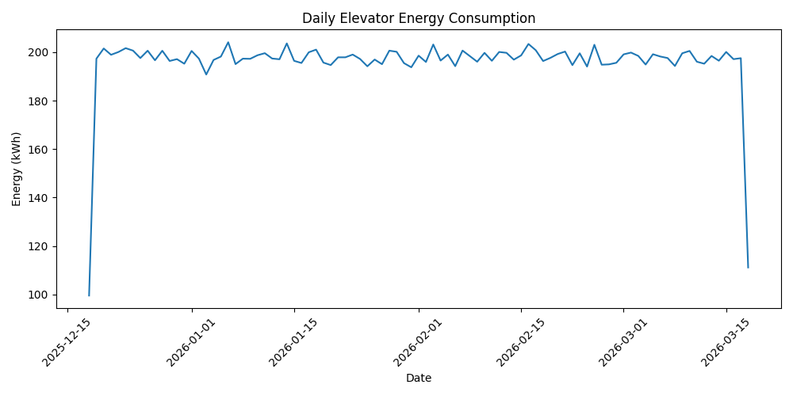

# KONE Elevator Energy Analytics

A data analytics project that analyzes elevator operational data to monitor energy consumption, regenerative energy recovery, and traffic patterns.

## Project Overview

Modern elevators generate large amounts of operational data.
This project analyzes that data to identify energy consumption trends, regenerative energy recovery, and usage patterns across buildings.

The project includes:

* Data analysis using Python and Pandas
* Data visualization with Matplotlib
* A Flask dashboard for monitoring elevator metrics
* SQLite database for operational data storage

---

## Key Metrics Analyzed

* Total energy consumption (kWh)
* Regenerative energy savings
* Elevator traffic (number of trips)
* Average cabin load utilization
* Standby energy consumption

---

## Dashboard Example



---

## Technologies Used

Python
Pandas
Matplotlib
SQLite
Flask
Jupyter Notebook

---

## Project Structure

```
kone-elevator-energy-analytics
│
├── data/
│   └── kone_energy.db
│
├── notebook/
│   └── energy_analysis.ipynb
│
├── templates/
│   └── index.html
│
├── screenshots/
│   └── daily_energy.png
│
├── server.py
├── seed_db.py
├── db.py
├── requirements.txt
└── README.md
```

---

## How to Run the Project

Install dependencies

```
pip install -r requirements.txt
```

Seed the database

```
python seed_db.py
```

Run the server

```
python server.py
```

Then open:

```
http://localhost:5000
```

---

## Example Insights

From the dataset analysis:

* Elevator traffic peaks occur during morning and evening commuting hours.
* Regenerative braking recovers approximately **12–15% of total energy**.
* Standby energy contributes a consistent baseline consumption.

These insights can help optimize elevator operations and improve building energy efficiency.

---

## Future Improvements

* Predictive energy consumption forecasting
* Anomaly detection for elevator energy spikes
* Real-time data ingestion
* Interactive dashboard with Plotly

---

## Author

Minmin
Data Analytics Portfolio Project
